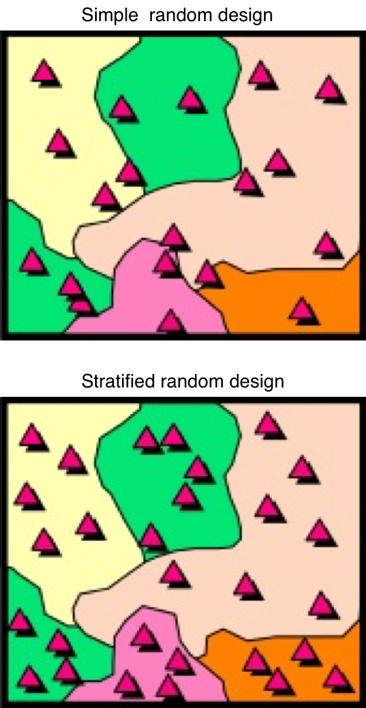

```{r, load_refs, echo=FALSE, cache=FALSE, message=FALSE}
library(RefManageR)
library(readr)
library(kableExtra)

options(knitr.kable.NA = '')

BibOptions(check.entries = FALSE, 
           bib.style = "authoryear", 
           cite.style = 'authoryear', 
           style = "markdown",
           hyperlink = FALSE, 
           dashed = FALSE)
myBib <- ReadBib("assets/example.bib", check = FALSE)
```


## Outline

```{r, echo=FALSE, message=FALSE}
read_csv("assets/tables/envx2001_outline.csv") %>%
  kable() %>%
  # collapse_rows(columns = 1:6, valign = "top") %>%
  kable_styling(font_size = 16) %>%
  pack_rows("Part 1: Designed Studies", 1, 6) %>%
  pack_rows("Part 2: Finding Patterns in Data", 7, 12) %>%
  pack_rows("Part 3: Revision", 13, 13) %>%
  row_spec(c(2, 4), bold = TRUE, color = "darkgreen")
```


---
## Last week...Learning outcomes

.pull-left[
- Explain differences between 
  - samples & populations 
  - standard error & standard deviation;
- Describe key features of their data using 
  - summary statistics, 
  - graphical summaries and 
  - confidence intervals;
- Demonstrate proficiency in the use of R for calculating summary statistics and generating graphical summaries and performing 1-sample t-tests.
]


---
## Last week...Learning outcomes

.pull-left[
- Explain differences between 
  - samples & populations 
  - standard error & standard deviation;
]
.pull-right[

]


---
## Last week...Learning outcomes

.pull-left[
- Explain differences between 
  - samples & populations 
  - standard error & standard deviation;
- Describe key features of their data using 
  - summary statistics, 
  - graphical summaries and 
  - confidence intervals;
]
.pull-right[
```{r, eval=F}
summary()
plot()
boxplot()
ttest()
```
]


---
## Last week...Learning outcomes

.pull-left[
- Explain differences between 
  - samples & populations 
  - standard error & standard deviation;
- Describe key features of their data using 
  - summary statistics, 
  - graphical summaries and 
  - confidence intervals;
- Demonstrate proficiency in the use of R for calculating summary statistics and generating graphical summaries and performing 1-sample t-tests.
]
.pull-right[
```{r, eval=F}
summary()
plot()
boxplot()
ttest()
```

```{r, echo=F, out.width="80%"}
boxplot(Sepal.Length~Species,data=iris)
```

]


---
class: sydney-blue, middle, center

# This week

---
## Learning Outcomes

At the end of this Topic, students should be able to:

.pull-left[
- Calculate means and their uncertainty for a
  - simple random design
  - stratified random design
- Make simple recommendations for designing sampling schemes
- Demonstrate proficiency in the use of R for analysis of sample design data, for
  - estimating a mean
  - estimating a change in mean
  - choosing sample sizes
- Demonstrate proficiency in the use of R to generate sampling designs
]


---
## Learning Outcomes

At the end of this Topic, students should be able to:

.pull-left[
- **Calculate means and their uncertainty for a**
  - **simple random design**
  - **stratified random design**
- Make simple recommendations for designing sampling schemes
- Demonstrate proficiency in the use of R for analysis of sample design data, for
  - estimating a mean
  - estimating a change in mean
  - choosing sample sizes
- Demonstrate proficiency in the use of R to generate sampling designs
]
.pull-right[
.center[

]
]


---
## Learning Outcomes

At the end of this Topic, students should be able to:

.pull-left[
- Calculate means and their uncertainty for a
  - simple random design
  - stratified random design
- **Make simple recommendations for designing sampling schemes**
- Demonstrate proficiency in the use of R for analysis of sample design data, for
  - estimating a mean
  - estimating a change in mean
  - choosing sample sizes
- Demonstrate proficiency in the use of R to generate sampling designs
]
.pull-right[

.footnote[Source: https://www.gocomics.com/calvinandhobbes/2015/08/26]
]


---
## Learning Outcomes

At the end of this Topic, students should be able to:

.pull-left[
- Calculate means and their uncertainty for a
  - simple random design
  - stratified random design
- Make simple recommendations for designing sampling schemes
- **Demonstrate proficiency in the use of R for analysis of sample design data, for**
  - **estimating a mean**
  - **estimating a change in mean**
  - **choosing sample sizes**
- Demonstrate proficiency in the use of R to generate sampling designs
]
.pull-right[

]


---
## Learning Outcomes

At the end of this Topic, students should be able to:

.pull-left[
- Calculate means and their uncertainty for a
  - simple random design
  - stratified random design
- Make simple recommendations for designing sampling schemes
- Demonstrate proficiency in the use of R for analysis of sample design data, for
  - estimating a mean
  - estimating a change in mean
  - choosing sample sizes
- **Demonstrate proficiency in the use of R to generate sampling designs**
]
.pull-right[

.footnote[Source: https://mdcrosby.com/blog/animalai1.html]
]


---
## Outline

1. **Observational study** vs. **Controlled experiment**
2. **Surveying** vs. **Monitoring**

3. Sample designs
  - **Simple** random design
  - **Stratified** random design


---

## Controlled experiment vs. Observational study

.center[Recap:]
```{r, echo=FALSE}
 exps <- data.frame("Controlled experiments" = c("Comparative", "Manipulative"),
   "Observational studies" = c("Absolute", "Mensurative"))

kable(exps, col.names = c("Controlled experiments", "Observational studies"))
```

--
<br>
**Controlled experiment**: manipulate at least one variable (i.e. treatment), to study relationships.
- e.g. cause-effect; before-after 

**Observational study**: Measure things from observation of the natural variation between variables, with no manipulation.
- e.g. survey, monitoring
- [Australia State of the Environment Report](https://soe.environment.gov.au/theme/overview)


---
## Observational studies: surveying vs. monitoring

<br>

```{r, echo=F}
tecs <- data.frame(Survey = c("Aim: estimate statistic; e.g. mean", 
  "No temporal change in period or survey"), 
  Monitoring = c("Aim: estimate a change in statistic; e.g. mean", 
    "Temporal changes during period of observations"))

kable(tecs) %>%
  kable_styling(font_size = 20)
```

<br>
- For this lecture, we focus on the **mean value** for data collected over a **spatial area**
  - theory valid for totals, proportions
  - theory valid for sampling people, households, companies... *things*
  - a different approach will be needed for **mapping**
  
  
  
  
  
  
  
---
## Surveying: Definitions


- Estimating means (or totals, or proportions)
  - a random selection of population units, so that all have a probability of > 0 being selected
  - probability sampling
  - probability is called inclusion probability (π)
  - inclusion probability do not have to be equal for different population units
  
  
- Two types of populations
  - **finite**: discrete objects; e.g. no. of lakes, people
  - **infinite**: continuous variables; e.g.  water in lake, germs in people


???
- First of all, it is important that during a survey, you randomly select from the population. A random number generator.
- The formal term for this probability sampling. 
- Basically, it means that each of you has an attached probability when I sample from you.
- So for example, if there are 100 of you here, then each of you has a 50/50 chance of being sampled if I decide to randomly sample 50 students.
- And the probability attached to you is called inclusion probability.

Why do we randomly sample?
- We want to reduce bias as much as possible
- You may be performing a survey on a site that you know very well about
- So without randomisation, you may select sites that have easier access, or select locations because you already know that they will have the samples that you need. 
- That is bias and it confounds your experiment.

How we sample populations also depends on what type of population they are
- We have finite and infinite populations.
- Finite populations are made of discrete objects
- Infinite populations are values that may be too many to count or are just continuous variables.


---
## Surveying: Simple random sampling

- Fully random with no restrictions
- Two types:
  - sampling with replacement (SIR)
  - sampling *without* replacement (SI)
  
- Distinction only matters for **finite** populations
- **We focus on infinite populations in this topic**


???
So how do we sample
- in simple random sampling, it's just that - random.
- For example if I want to sample from this lecture, simple random sampling just means that I don't care about who I sample, as long as it is random. 
- So I don't care about your gender, or your age, or what your major is.


There are 2 types or random sampling
- Sample with replacement means that say, if I want to sample 


---
## Simple random sampling: Estimators

- Mean for simple random sampling, $\bar y_{SiR}$

$$\bar y_{SiR} = \frac{1}{n} \times \sum_{i = 1}^{n}y_i$$

- Variance (V) of the mean for simple random sampling
  - is actually the standard error of the mean<sup>2</sup>

$$V(\bar y_{SiR}) = \frac{s^2(y)}{n} = \frac{1}{n} \times \frac{\sum_{i = 1}^n(\bar y_{SiR} - y_i)}{n-1} = \frac{1}{n(n - 1)} \sum_{i = 1}^n (\bar y_{SiR} - y_i)^2$$

where $S^2(y)$ is the variance of the observations and $n$ is the number of observations.


---
## Confidence intervals

>Definition: the interval in which we are $a\%$ confident that the true population mean $\mu$ lies.

- Confidence intervals consist of:

  - an interval [lower:upper limit]
  - a degree of confidence; $a \%$ e.g. 95 %


- Confidence interval (CI) can be estimated from other parameters, but here we focus on the *mean*

- 95% CI for the mean is

$$95\% CI = \bar y \pm t^{0.025}_{n-1} \times se(\bar y)$$


---
## T-probability tables

.center[

]


---
# Data Story

.pull-left[

]

..pull-right[

- Sequestered soil carbon is worth $50/tonne if measured
- It costs $100 to collect and analyse a soil sample for soil carbon
- Need an estimate of mean carbon content for property 
- Is it worth measuring for a land holder?

]

- Soil carbon content was measured at 7 points across a farm
- The amount at each location was 48, 56, 90, 78, 86, 71, 42 tonnes per hectare (t/ha)


---
# Data Story 

.left-column[

.small[
- Soil carbon content was measured at 7 points across a farm
- The amount at each location was 48, 56, 90, 78, 86, 71, 42 tonnes per hectare (t/ha)
]
]

.right-column[


> What is the mean soil carbon content?

<br>
```{r, echo=FALSE}
# Data calculated elsewhere
stats <- data.frame(Design = "Simple", Mean = 67.29, Var = 50.80, 
  L95 = 49.85, U95 = 84.73, "d.f." = 6)

kable(stats) %>%
  kable_styling()
```

- How precise is this?
- How big a change must there be to estimate a statistically significant change?
- Are there better sampling techniques?
]


---
# Data Story 

.left-column[

.small[
- Soil carbon content was measured at 7 points across a farm
- The amount at each location was 48, 56, 90, 78, 86, 71, 42 tonnes per hectare (t/ha)
]
]

.right-column[

Alternative techniques:

- Systematic sampling
- Haphazard sampling
- Convenience sampling

In all cases, inclusion probabilities are unknown
  - bias will be present in estimates of mean and variance - *not random*

]


---
## Why not stick to random sampling?

Issues:

- Can have a "bad pick"
- Ignores underlying knowledge of the system


Solution:

- Divide the population into sub-groups: *strata*
- Do not overlap - union is total
- Randomisation still occurs - within strata

What do we address?

- Accuracy, since every strata is represented by a minimum number of samples
- Insight - we can obtain individual estimates for each strate


---
## Stratified random sampling

<br>
> How do we choose strata?

Many data sources available, e.g. for our Data Story:

- soil types
- land use
- elevation

e.g. University students:

- gender 
- degree cohort
- local/international


---
## Stratified random sampling: Estimators

- Mean for stratified random sampling (StR), $\bar y_{StR}$:

$$\bar y_{StR} = \sum^H_{h = 1}w_h \bar y_h$$

where $H$ is the number of stratum, $\bar y_h$ is the mean for stratum $h$, and $w_h$ is the weighting for each stratum, $h$. This can be determined by the proportion of the total study area that the stratum covers.

- The variance of the mean for stratified random sampling can be determined with:

$$V(\bar y_{SiR}) = \sum^H_{h = 1} w^2_h V(\bar y_h)$$


---
# Data Story 

.left-column[

.small[
- Soil carbon content was measured at 7 points across a farm
- The amount at each location was 48, 56, 90, 78, 86, 71, 42 tonnes per hectare (t/ha)
]
]

.right-column[
> What is the mean soil carbon content?

<br>
.pull-left[
```{r, echo=FALSE}
# Data calculated elsewhere
# strata <- data.frame(
#   C = "Strata", "90" = "A", "78" = "A", "86" = "A", "71" = "A",
#   "48" = "B", "56" = "B", "42" = "B")

strata <- data.frame(Sample = 1:7, C = c(90, 78, 86, 71, 48, 56, 42), 
  Strata = c(rep("A", 4), rep("B", 3)))
kable(strata, col.names = c("#", "C (t/Ha)", "Strata")) %>%
  kable_styling()
```
]
.pull-right[
Stratified by soil type: 

- A = Chromosol; 62 % of area
- B = Sodosol; 38 % of area

> What is the CI for the mean soil carbon content for the farm?
]
]


---
# Data Story

.left-column[

.small[
- Soil carbon content was measured at 7 points across a farm
- The amount at each location was 48, 56, 90, 78, 86, 71, 42 tonnes per hectare (t/ha)
]
]

.right-column[
> What is the mean soil carbon content?

<br>
.pull-left[
```{r, echo=FALSE}
# Data calculated elsewhere
# strata <- data.frame(
#   C = "Strata", "90" = "A", "78" = "A", "86" = "A", "71" = "A",
#   "48" = "B", "56" = "B", "42" = "B")

strata <- data.frame(Sample = 1:7, C = c(90, 78, 86, 71, 48, 56, 42), 
  Strata = c(rep("A", 4), rep("B", 3)))
kable(strata, col.names = c("#", "C (t/Ha)", "Strata")) %>%
  kable_styling()
```
]
.pull-right[

- Calculate the mean and variance for each strata.

- For Strata A: $\sum^n_{i = 1}(\bar y - y_i)^2 = 214.75$
- For Strata B: $\sum^n_{i = 1}(\bar y - y_i)^2 = 98.67$
- Excel
]
]


???
We are determining the variance of the mean for each strata here
- in other words, how far each observation is from the strata mean


---
## Adding up Variances in stratified sampling: Theory

- Variance is weighted to each strata:
  - $Var(Y) = b^2 Var(X)$ 

- If we add individual variances, we must also consider the covariance term
  - $Var (Z) = Var (X) + Var(Y) + 2 \times Covariance(X, Y)$

- Same for subtracting variances
  - $Var (Z) = Var (X) - Var(Y) - 2 \times Covariance(X, Y)$


---
## Worked example: Excel

- Can do in R, but too complicated for you right now

Notes:
- Calculations are still based on the Data Story
- Template will be used in Lab
- The aim is to determine the 95% CI for stratified sampling
- We can also compare the efficiency of stratified sampling vs simple random sampling


---
# Data Story

.left-column[

.small[
- Soil carbon content was measured at 7 points across a farm
- The amount at each location was 48, 56, 90, 78, 86, 71, 42 tonnes per hectare (t/ha)
]
]

.right-column[

```{r, echo=FALSE, message=FALSE}
read_csv("assets/tables/simplestrat.csv") %>%
  kable() %>%
  kable_styling()
```

<br>
> What differences can you see?

- Mean?
- Variance?
- 95 % CI?

]


---
## Stratified random sampling

- Efficiency of strata calculated by: ${V(\bar y_{SiR})}/{V(\bar y_{SiR})}$
  - indicates sampling effort required to achieve precision of stratified sampling

```{r}
50.80/9.254
```

- Generally allocate number of samples per strate, proportional to strata area
- Alternate: proportional to $[variation\ of\ strata \times area\ of\ strata]$


---
## Monitoring

- What if we come back to the same site and do another set of measurements?
- The interest move s to the *change* in mean
- A **monitoring** design/problem


---
## Monitoring

Change in mean and the precision of the estimate

- Estimate of mean change
  - $\Delta \bar y = \bar y_2 - \bar y_1$

- Estimate of variance of change in mean
  - $Var(\Delta \bar y) = Var(\Delta \bar y_2) + Var(\Delta \bar y_1) - 2 \times Cov(\bar y_1, \bar y_2)$
  
- Covariance
  - Observations 
  $$Cov(y_1, y_2) = \frac{\sum(y_{i,1} - \bar y_1)(y_{i,2} - \bar y_2)}{n-1}$$
  - Means
  $$Cov(\bar y_1, \bar y_2) = \frac{Cov(y_1, y_2)}{n}$$
  
  
  


---
# Data Story 

.left-column[

.small[
- Soil carbon content was measured at 7 points across a farm
- The amount at each location was 48, 56, 90, 78, 86, 71, 42 tonnes per hectare (t/ha)
]
]

.right-column[

S2 are re-sampled values 

.pull-left[
```{r, echo=FALSE}
# Data calculated elsewhere
# strata <- data.frame(
#   C = "Strata", "90" = "A", "78" = "A", "86" = "A", "71" = "A",
#   "48" = "B", "56" = "B", "42" = "B")

strata <- data.frame(Sample = 1:7, C = c(90, 78, 86, 71, 48, 56, 42), 
  D = c(99, 85, 92, 81, 58, 65, 56),
  Strata = c(rep("A", 4), rep("B", 3)))
kable(strata, col.names = c("#", "S1 (t/Ha)", "S2 (t/Ha)", "Strata")) %>%
  kable_styling()
```
]
.pull-right[
Calculate the CI for the mean change in soild carbon content for the farm if we
  1. revisit;
  2. don't revisit sites.
]
]


---

## Monitoring

Change in mean and the precision of the estimate

- Hypothesis tests:

$$H_0: \Delta \bar y = 0$$
$$H_0: \Delta \bar y \neq 0$$

- Revisit sites
  - equivalent to paired t-test (will show in lab)

- Don't revisit sites
  - covariance term is zero (0) (we cannot measure it)
  - equivalent to 2-sample t-test (will show in lab)


---
## Sample size

Approaches
- estimate mean

  - target standard error of the mean
  - CI width relative to the mean


- estimating change in mean
  
  - depends on variation
  - depends on magnitude of change


---
## Readings